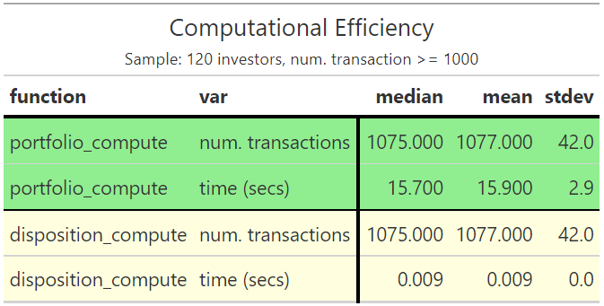

class: center, top
# The Speakers

&nbsp;

.pull-left[
```{r, echo=FALSE, out.width='85%', fig.alt='Lorenzo Mazzucchelli pic'}

```

**Lorenzo Mazzucchelli**  
*Phd, University of Milan*  
[*Linkedin*](https://www.linkedin.com/in/lorenzo-mazzucchelli-72a661122/)

]

.pull-right[
```{r, echo=FALSE, out.width='85%', fig.alt='Marco Zanotti pic'}

```  

**Marco Zanotti**  
*Data Scientist, Triboo*  
[*Linkedin*](https://www.linkedin.com/in/marco-zanotti-a6a978124/), 
[*Website*](https://marcozanotti.netlify.app/)

]


---
class: chapter-slide, left, middle
# The Disposition Effect


---
# Definition

&nbsp;  

.center[
### Disposition Effect (DE)  
  
**the realization that investors are more likely to sell an asset 
when it is gaining value compared to when it is losing value.**
]
 

&nbsp;  

An irrational phenomenon which is closely related to sunk costs’ bias, 
diminishing sensitivity, and loss aversion.  

It is observed on financial and real stock markets.


---
# History

From **1985**, the disposition effect has been documented in US 
retail stock investors, as well as in foreign retail investors, 
and even among professionals and institutions.

&nbsp;  

* Discovered by Shefrin and Statman (1985)

* Empirically studied by Odean (1998) on the US financial market.
He developed a method to measure it.

* Grinblatt and Keloharju (2001) showed that financial institutions
have a smalle DE, but they still behave according to it. 

* Nowadays the focus has turned from single stocks in the portfolio 
to the so-called *Portfolio Driven Disposition Effect*, 
Engelberg et al (2019).  


---
# Computation

Difference between the ratio of unrealized gains (losses) over 
the total opportunity, realized or not, of gains (losses).

$$DE = \bigg(\frac{RG}{RG + PG}\bigg) - \bigg(\frac{RL}{RL + PL}\bigg)$$

*where RG/RL = realized gains/losses, PG/PL = paper gains/losses*

**After each investor’s trade**, one needs to **record the number
of different stocks in the investor’s portfolio** that are 
**sold for a gain** [1], **sold for a loss** [2], 
**not sold at a gain** [3], and **not sold at a loss** [4] <sup>*</sup>. 

Gains and losses of the stocks are computed by comparing the actual
market price with the original purchasing price.

&nbsp;  

.right[
.footnote[
<sup>\*</sup>*Realized gains [1] and losses [2] are actual 
trades in which the investor realizes a profit or a loss. 
Stocks not sold are called paper gains [3] and paper losses [4].*
]
]


---
# Why is DE important?

1. DE can be found in variety of contexts. Past researches
have shown DE in auctions, house markets, financial markets, 
etc. DE could be also found in policy contexts, such as 
Vietnam War.

2. Mutual funds that are "DE-prone" have inferior 
performance by 4-6% with respect to "non-DE-prone" funds, 
as shown by Singal and Xu (2011).

3. Understanding DE could help financial authorities 
managing regulations and intervention on the markets.  

4. DE is another relevant case of irrationality of agents. 
Its presence leads to further evidence of the inconsistency of 
classical economic theory, based on the rational agent hypothesis. 

Hence, being able to correctly and timely capture these 
irrational behaviours is very important, especially in periods 
of high uncertainty and crisis.


---
class: center, middle

```{r, echo=FALSE, out.width='50%', fig.align='center', fig.alt='dispositionEffect Logo'}
knitr::include_graphics("figures/logo.png")
```

.pull-left[
###[**Github repo**](https://github.com/marcozanotti/dispositionEffect)
]
.pull-right[
###[**Website**](https://marcozanotti.github.io/dispositionEffect/)
]

```{r, echo=FALSE, out.width='70%', fig.align='center', fig.alt='Badges'}

```


---
class: chapter-slide, left, middle
# dispositionEffect Package


---
# Package Functions

&nbsp;  

* `gains_losses`  
the core function of the package, it performs all the calculations
of realized and paper gains and losses, and it can be used for 
stream-data calculations.  
It is intended for advanced users only.

* `portfolio_compute`  
a user-friendly interface to compute realized and paper gains and losses
from the investor’s transactions and the market prices of the traded assets.  
It also updates the investor’s portfolio.

* `disposition_compute`, `disposition_summary`  
the two interfaces to easily compute the disposition effect 
and summary statistics, based on *portfolio_compute* output.


---
# Input Data

&nbsp;  

.pull-left[
.center[
###**Transactions**]
All the financial transactions an investor did during a specific
period of time.  

A single transaction is made up of 6 features: the investor id, 
the asset id, the type of the transaction (buy or sell), 
the traded quantity, the traded price, and the trading datetime.
]

.pull-right[
.center[
### **Market Prices**]
.right[
The actual prices found on the stock markets for each traded 
asset on each transaction datetime.  

A single observation is made up of 3 features: the asset id,
the datetime, and the market value of the asset.]
]


---
# Investor's Transactions

```{r, echo=FALSE, fig.alt='Table of investor transactions.'}
DT::datatable(
  dispositionEffect::investor,
  fillContainer = FALSE, options = list(pageLength = 6)
)
```


---
# Market Prices

```{r, echo=FALSE, fig.alt='Table of market prices.'}
DT::datatable(
  dispositionEffect::marketprices,
  fillContainer = FALSE, options = list(pageLength = 6)
)
```


---
background-image: url("figures/diagram.png")
background-size: 95%
background-position: 50% 80%
class: left, top

# How to compute DE?


---
# Main Function: `portfolio_compute`

```{r, tidy=FALSE, eval=FALSE}
portfolio_compute(
  portfolio_transactions, market_prices, 
* method = "count", 
* allow_short = TRUE,
  time_threshold = "0 mins",
  exact_market_prices = TRUE,
* portfolio_driven_DE = FALSE,  
* time_series_DE = FALSE, assets_time_series_DE = NULL, 
  verbose = c(0, 0), progress = FALSE
)
```

Highly flexible, different methods implemented, few different analysis.

&nbsp;
&nbsp;  

.right[.footnote[
See vignette [The Analysis of Disposition Effect](https://marcozanotti.github.io/dispositionEffect/articles/de-analysis.html)
]]


---
# Computational Efficiency

On **stream data**, computation is **instantaneous**.

On **batch data**, the **number of transactions** and the 
**number of traded assets** impact on `portfolio_compute`.

`disposition_compute` is **instantaneous**.

```{r, echo=FALSE, out.width='70%', fig.align='center', fig.alt='Table of computational efficiency results for portfolio_compute and disposition_compute'}

```

.right[.footnote[
See vignette [Disposition Effect in Parallel](https://marcozanotti.github.io/dispositionEffect/articles/de-parallel.html)
]]


---
class: center, middle
# Thanks!

<a href='https://marcozanotti.github.io/dispositionEffect/'></a>

Lorenzo Mazzucchelli, Marco Zanotti  

[download presentation](https://github.com/marcozanotti/dispostionEffect-useR2021)
